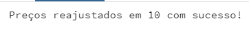
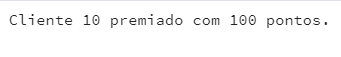
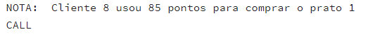

# Projeto Banco de Dados Restaurante

Sistema de banco de dados desenvolvido na disciplina de banco de dados 2.

## Alunos
- Matheus Garcia
- Lucas Chaves
- Ana Carolina Ribeiro
- Marcelo Nunes

## Pré-requisitos
 Usaremos Javascript como linguagem de apoio e PostgreSQL como banco de dados.

1. Instale o PostgreSQL e crie um usuário que será utilizado nas conexões.

2. Instale as dependências do projeto usando o comando:
    ```bash
    npm install
    ```

## 1. Criar o Banco de Dados

Primeiro, verifique se o banco de dados `restaurante` já existe. **Se ele já foi criado**, use o [db.js](config/db.js) para se conectar ao banco.

Caso contrário, use o [createDatabase](querys/createDatabase.js) para criar o banco de dados. Ele será criado automaticamente no Postgre.

1. Abra o terminal.
2. Navegue até o diretório `db`.
3. Execute o comando abaixo para criar o banco:

```bash
node createDatabase.js
```

Este comando é o primeiro passo da configuração, para garantir que o banco restaurante esteja pronto antes da criação das tabelas.

## 2. Criar as Tabelas Iniciais

Após garantir que o banco `restaurante` exista, você pode criar as tabelas necessárias para o funcionamento do projeto.

1. Ainda no diretório db, execute o arquivo [createTable.js](querys/createTables.js):

 ```bash
node createTable.js
 ```

Com isso, as tabelas inicias são criadas no Postgre.

## 2. Inserir Valores Iniciais

Com as tabelas prontas, o próximo passo é inserir nossos valores iniciais para facilitar o uso do banco.

Execute o arquivo `insertData.js`:
```bash
node insertData.js
```
Foram feitos 10 inserts nas tabelas: Cliente, prato, fornecedor, ingrediente e venda. Clique [aqui](/querys/insertData.js) para conferir.

---

## 3. Criar os Triggers

### 1. Trigger `ingredientes_AFTER_INSERT`
Esse trigger é executado **após a inserção** de um novo ingrediente na tabela `ingredientes`.

#### Objetivo
O objetivo deste trigger é verificar se o ingrediente recém-inserido está vencido (ou seja, se sua `data_validade` é anterior à data atual). Caso esteja vencido, o trigger define os pratos que utilizam esse ingrediente como indisponíveis.

#### Funcionamento
1. Verificação da Data de Validade: O trigger verifica a validade do ingrediente (`NEW.data_validade < CURRENT_DATE`). Se a data de validade é anterior à data atual, significa que o ingrediente está vencido.
2. Atualização da Disponibilidade: Caso o ingrediente esteja vencido, o trigger atualiza a disponibilidade dos pratos que utilizam esse ingrediente.
   - Ele faz uma junção (`JOIN`) entre as tabelas `prato` e `usos` para encontrar os pratos que usam o ingrediente recém-inserido.
   - Define a `disponibilidade` desses pratos como `0`, indicando que estão indisponíveis.


### 2. Trigger `ingredientes_AFTER_UPDATE`
Esse trigger é executado **após uma atualização** na tabela `ingredientes`.

#### Objetivo
Semelhante ao `ingredientes_AFTER_INSERT`, este trigger também verifica se o ingrediente atualizado está vencido e, caso esteja, marca os pratos que o utilizam como indisponíveis.

#### Funcionamento
1. Verificação da Validade do Ingrediente: Quando um ingrediente é atualizado, o trigger verifica se ele está vencido (`NEW.data_validade < CURRENT_DATE`).
2. Atualização dos Pratos: Se o ingrediente atualizado está vencido, o trigger desativa os pratos que utilizam esse ingrediente, definindo sua `disponibilidade` como `0`.

### 3. Trigger `usos_AFTER_INSERT`
Esse trigger é acionado **após a inserção** de uma nova associação entre um ingrediente e um prato na tabela `usos`.

#### Objetivo
Reduz a quantidade do ingrediente associado ao prato em 1 unidade, se a quantidade disponível do ingrediente for maior que zero.

#### Funcionamento
1. Verificação de Quantidade: O trigger verifica a quantidade disponível do ingrediente (`quantidade > 0`).
2. Redução de Estoque: Caso a quantidade do ingrediente seja positiva, o trigger diminui a `quantidade` em 1, refletindo o uso do ingrediente no prato.


### 4. Trigger `venda_BEFORE_INSERT`
Esse trigger é acionado **antes da inserção** de uma nova venda na tabela `venda`.

#### Objetivo
O objetivo deste trigger é garantir que o prato que se deseja vender esteja disponível e que todos os ingredientes estejam dentro da validade. Caso alguma dessas condições não seja atendida, o trigger insere uma mensagem de motivo de erro (`motivo`) e impede a venda.

#### Funcionamento
1. Verificação de Disponibilidade: 
   - O trigger seleciona a disponibilidade do prato e armazena na variável `disponibilidade`.
   - Se o prato não está disponível (`disponibilidade = 0`), ele define o campo `motivo` como `'Prato indisponível'`.

2. Verificação de Ingredientes Vencidos:
   - O trigger verifica se o prato possui algum ingrediente vencido.
   - Ele conta os ingredientes vencidos associados ao prato e armazena o número na variável `ingrediente_vencido`.
   - Se algum ingrediente estiver vencido (`ingrediente_vencido > 0`), define o campo `motivo` como `'Ingredientes vencidos no prato'`.


### 5. Trigger `venda_AFTER_INSERT`
Esse trigger é ativado **após a inserção** de uma venda na tabela `venda`.

#### Objetivo
Reduz a quantidade dos ingredientes utilizados no prato vendido e atualiza os pontos do cliente com base no valor e quantidade da venda.

#### Funcionamento
1. Redução de Estoque de Ingredientes:
   - O trigger atualiza a tabela `ingredientes` para diminuir a `quantidade` de cada ingrediente associado ao prato vendido.
   - Ele usa uma subconsulta para selecionar os `id_ingrediente` da tabela `usos`, onde o prato vendido (`NEW.id_prato`) é associado ao ingrediente.
   - Reduz a `quantidade` em 1 para cada ingrediente, desde que a quantidade seja maior que zero.

2. Atualização dos Pontos do Cliente:
   - O trigger atualiza os pontos do cliente que realizou a compra (`id_cliente`).
   - Calcula os pontos como `(NEW.quantidade * NEW.valor) / 10` e adiciona ao saldo atual de pontos do cliente, incentivando a fidelidade dos clientes com base no valor das compras.

Esses triggers, ao serem executados automaticamente, facilitam o gerenciamento do inventário, garantindo que pratos com ingredientes vencidos sejam retirados do cardápio, controlando a quantidade de ingredientes e oferecendo recompensas de pontos aos clientes conforme suas compras.


## 4. Criar os Users

Foi definido os seguintes Users para nosso projeto:

- administrador (todos os privilégios)
- gerente (privilégios para selecionar, deletar e atualizar)
- funcionario (privilégios para inserir e selecionar)

Execute o arquivo:
```bash
node createUsers.js
```

## 5. Criar as Views

Foi definido as seguintes Views para nosso projeto:

- vendas_totais_por_cliente: vendas por cliente.
- frequencia_pedidos_prato: pratos mais pedidos do restaurante.
- ingredientes_mais_usados_pratos_disponiveis: ingredientes mais utilizados nos pratos do restaurante.

Execute o arquivo:
```bash
node createViews.js
```

## 6. Excluir o Banco de Dados
Para garantir que o banco de dados `restaurante` seja excluído do Postgre, siga os passos abaixo:

1. **Executar o Script**

   Abra o terminal, navegue até o diretório `querys`, e execute o comando para rodar o script `dropDatabase.js`:

    ```bash
    node dropDatabase.js
    ```

2. **Confirmação da Exclusão**

   Se o script for executado corretamente, o banco `restaurante` será completamente removido. E a
   seguinte  mensagem irá aparecer em seu terminal:
   ```bash
   Banco de dados destruído com sucesso!
   ```
   Verifique no PostgreSQL se o banco não aparece mais na lista de bancos de dados.

Esse processo é útil caso precise resetar o ambiente para testar o fluxo de criação do banco novamente.


# Procedimentos

## 1. Procedimento - Reajustar Preços

O procedimento `reajustarPrecos.js` aplica um reajuste de preço, em percentual, aos pratos do restaurante que aumenta o valor de todos os pratos.

1. Navegue até o diretório `service` do projeto no seu terminal.

2. Execute o script com o comando:

```bash
node reajustarPrecos.js
 ```

O script ajustará os preços na tabela prato conforme a porcentagem de reajuste especificada no código [reajustarPrecos.js](service\reajustarPrecos.js). No caso, estamos reajustando em 10% o valor dos pratos.

### 2. Usando o Procedimento no Postgre

Para usarmos o procedimento no Postgre, vamos escrever o seguinte comando SQL:

```PostgreSQL
CALL public.reajustar_precos(10)
```
Retorno no PostgreSQL:




## 2. Procedimento - Sorteio

Esse procedimento `sortearPremiacao.js` sorteia clientes  aleatoriamente para que este cliente receba uma
premiação de 100 pontos.


### 1. Executar o Script de Sorteio

1. Navegue até o diretório `service` do projeto no seu terminal.

```bash
node sortearPremiacao.js
```

Ele selecionará clientes aleatórios da tabela cliente, aplicando um benefício de 100 pontos a esse cliente. [sortearPremiacao.js](service/sortearPremiacao.js)

### 2. Usando o Procedimento no Postgre

Para usarmos o procedimento no Postgre, vamos escrever o seguinte comando SQL:

```PostgreSQL
CALL public.sortear_premiacao()
```
Retorno no PostgreSQL:



## 3. Procedimento - Estatística

A funcionalidade **Estatísticas de Vendas** permite consultar as vendas de produtos e exibir as seguintes informações:

- **Produto mais vendido**
- **Vendedor associado ao produto mais vendido**
- **Produto menos vendido**
- **Valor total ganho com o produto mais vendido**
- **Valor total ganho com o produto menos vendido**
- **Mês de maior e menor volume de vendas para o produto mais vendido**
- **Mês de maior e menor volume de vendas para o produto menos vendido**

### 1. Executar o Script de Estatísticas

Abra o terminal, navegue até o diretório `service` onde o arquivo `estatisticas.js` está localizado e execute o seguinte comando para rodar o script:

```bash
node estatisticas.js
```
### 2. Usando o Procedimento no Postgre

Para usarmos o procedimento no Postgre, vamos escrever o seguinte comando SQL:

```PostgreSQL
CALL public.calcular_estatisticas_vendas()
```
Retorno no PostgreSQL:


## 4. Procedimento - Gastar Pontos

O Procedure **Gastar Pontos** permite que um cliente utilize seus pontos para pagar por um prato. A cada ponto do cliente corresponde a **1 real** de desconto. Caso o valor do prato tenha centavos, um ponto extra será utilizado para cobrir a diferença. Se o cliente tiver pontos suficientes para mais de um prato, a diferença dos pontos não utilizados será mantida como saldo.

- 1 ponto = 1 real.
- Se o valor do prato tiver centavos, um ponto extra é usado para cobrir o valor.
- Caso o cliente tenha pontos a mais que o valor do prato, a diferença fica como saldo, sem zerar os pontos.

### 1. Executando o Procedure Gastar Pontos

Abra o terminal, navegue até o diretório `service` onde o arquivo `gastarPontos.js` está localizado e execute o seguinte comando para rodar o script:

```bash
node gastarPontos.js
```

### 2. Usando o Procedimento no Postgre

Para usarmos o procedimento no Postgre, vamos escrever o seguinte comando SQL:

```PostgreSQL
CALL public.gastar_pontos(8,1) // id cliente e id prato
```
Retorno no PostgreSQL:




---

# Função - Function

## Calculo de Pontos

A função **`calcular_pontos`** recebe um valor de compra e retorna a quantidade de pontos acumulados. O valor da compra é dividido por 10, e a parte inteira do valor é convertida em pontos. Compras de valores menores que 10 reais não geram pontos.
- Para cada 10 reais gastos, o cliente ganha **1 ponto**.
- Valores que não completam os 10 reais **não geram pontos**.

### 1. Executar o a Função Calculo Pontos

Abra o terminal, navegue até o diretório `service` onde o arquivo `calcularPontos.js` está localizado e execute o seguinte comando para rodar a função:

```bash
node calcularPontos.js
```
Com isso, será criado no Postgre a Function.

### 2. Usando a Função no Postgre

Para usarmos a Function no Postgre, vamos escrever o seguinte comando SQL:

```PostgreSQL
SELECT public.calcular_pontos(50.0)
```
Retorno no PostgreSQL:


Pronto, com isso conseguimos calcular a quantidade de pontos acumulados baseado em um valor de compra.


